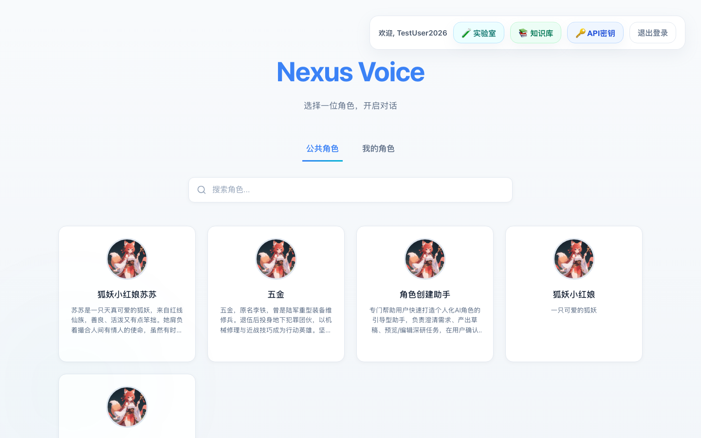
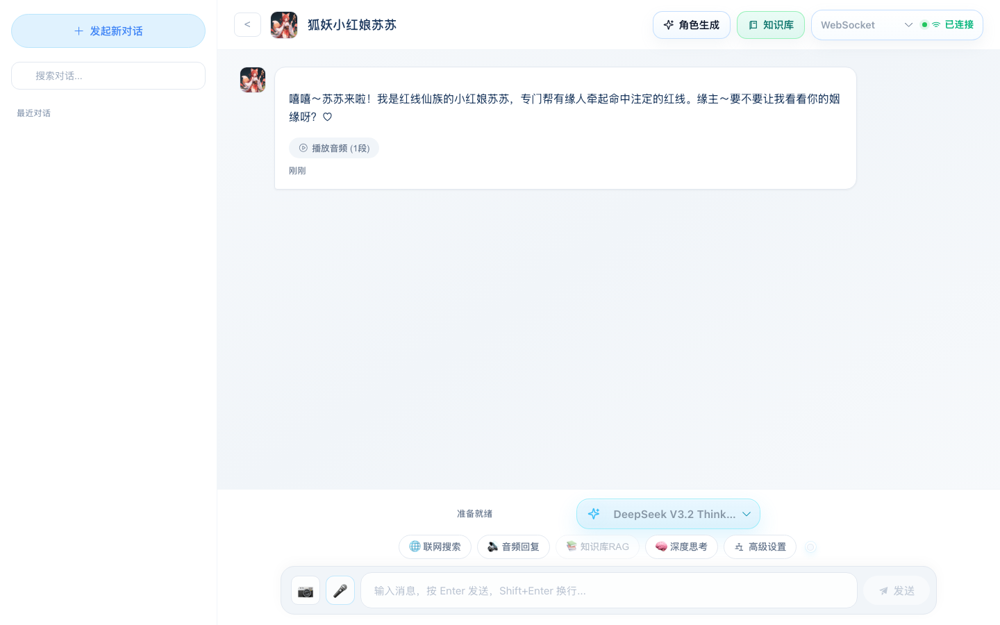
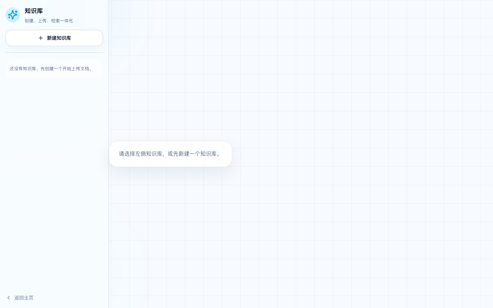
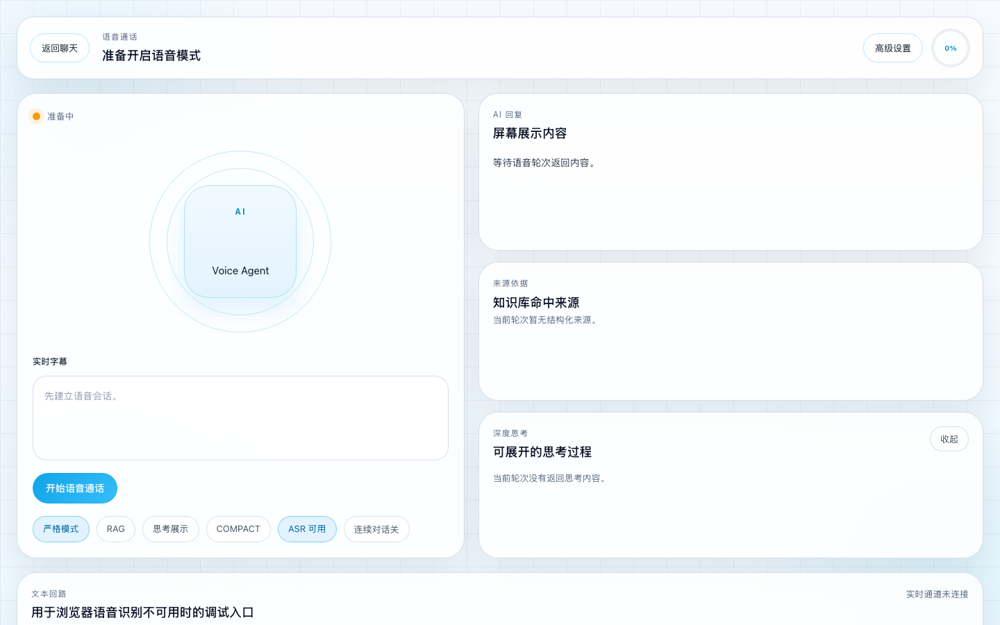
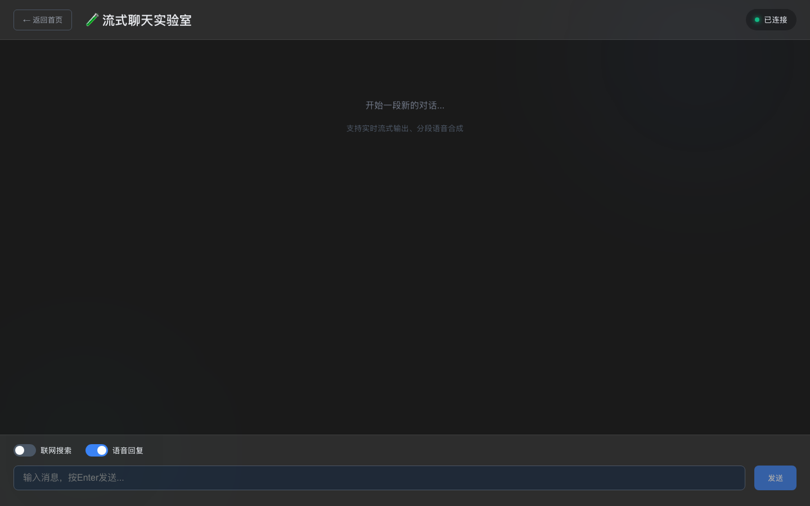
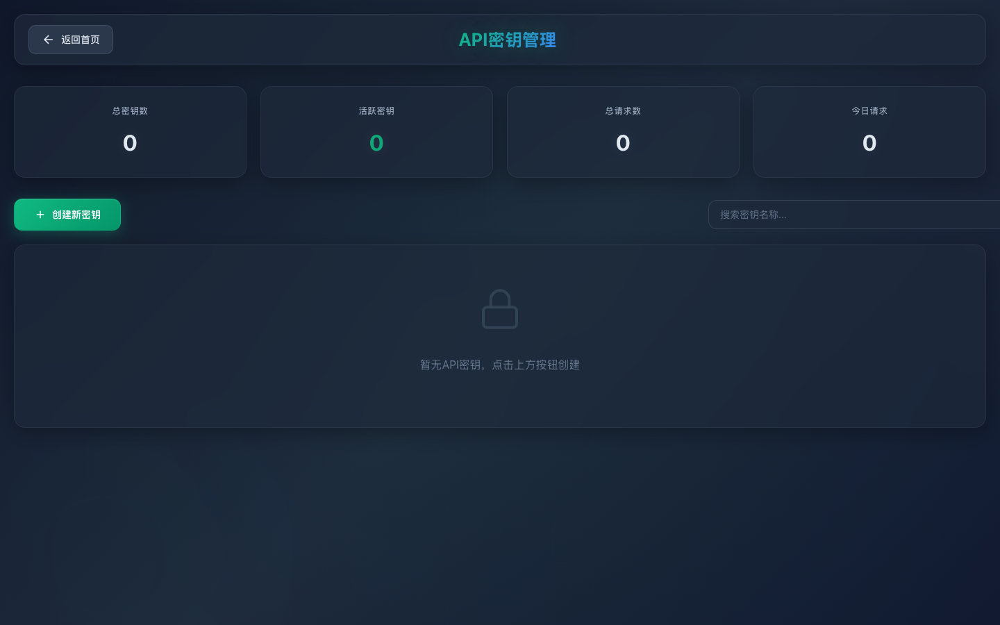

# NexusVoice 🎙️

> 🚀 企业级多模态AI对话平台，基于DDD架构 + Java 21虚拟线程 + 动态模型管理，打造极致的AI交互体验

[](https://spring.io/projects/spring-boot)
[](https://vuejs.org/)
[](https://github.com/langchain4j/langchain4j)
[](https://openjdk.org/projects/jdk/21/)
[](https://www.postgresql.org/)

## ✨ 项目介绍

NexusVoice 是一个**生产级的多模态AI对话平台**，采用严格的DDD架构设计，集成了智能对话、图像生成、语音合成、实时搜索等AI能力。项目核心亮点在于**WebRTC实时语音对话**、**通用Agent智能体系统**、**工具生态封装**、**完全动态化的模型管理**、**Java 21虚拟线程并发优化**和**三级缓存架构**，为企业级AI应用提供坚实的技术基础。

## 📸 项目预览

<table>
  <tr>
    <td width="50%">
      
    </td>
    <td width="50%">
      
    </td>
  </tr>
  <tr>
    <td width="50%">
      
    </td>
    <td width="50%">
      
    </td>
  </tr>
  <tr>
    <td width="50%">
      
    </td>
    <td width="50%">
      
    </td>
  </tr>
</table>


### 🎯 为什么选择 NexusVoice？

#### 🤖 多模态AI能力
- **智能对话** - 支持OpenAI、Grok、DeepSeek等多种模型，动态热切换
- **实时语音对话(WebRTC)** ⭐ - 端到端延迟P95<600ms，Kurento媒体网关 + gRPC双向流（测试阶段）
- **通用Agent系统** ⭐ - 模板方法模式，支持多步推理、工具调用、上下文管理
- **工具生态封装** ⭐ - BaseTool接口 + ToolRegistry注册中心，即插即用
- **实时联网搜索** - MCP搜索系统，AI智能判断何时搜索，DuckDuckGo集成
- **AI图像生成** - 硅基流动API，支持Qwen/Kolors 4种模型，自动CDN上传
- **语音合成(TTS)** - 智能文本分段 + 虚拟线程并发上传 + 实时音频播放
- **流式对话** - SSE/WebSocket双协议支持切换，支持分段TTS流式输出

#### 🏗️ 核心技术亮点

##### 🔥 **最新技术亮点** ⭐⭐⭐

###### 1️⃣ **WebRTC实时语音对话系统**（🚧 测试阶段）
- **当前状态**：核心功能已实现，正在进行稳定性测试和性能优化
- **企业级架构**：浏览器 ↔ Kurento媒体网关 ↔ gRPC双向流 ↔ ASR/TTS
- **极致低延迟**：端到端P95 < 600ms，P99 < 800ms
- **安全传输**：SRTP/DTLS/ICE，RTP永不出主机，经本地桥接进程转换
- **信令系统**：WebSocket信令 + ICE候选者收集 + 连接状态监控
- **音频优化**：Opus 48k编码，支持FEC前向纠错，弱网下自适应
- **半双工MVP**：先说完播模式，打断机制基于源头停推 + 零样本静音帧
- **未来规划**：计划改造成Go语言实现，提升性能和部署效率

###### 2️⃣ **通用Agent智能体系统**
- **模板方法模式**：`BaseAgentExecutor`定义标准执行流程，子类实现策略
- **多步推理**：支持多步执行循环，自动管理执行上下文和状态
- **工具调用能力**：集成工具注册中心，Agent可动态调用外部工具
- **超时保护**：最大步数限制、执行时长监控、错误恢复机制
- **执行记录**：完整记录每步执行历史，便于调试和优化
- **状态管理**：`AgentState`状态机管理（IDLE/RUNNING/FINISHED/FAILED）

###### 3️⃣ **工具生态封装（Tool Framework）**
- **BaseTool接口**：统一工具接口，定义execute方法、参数定义、元数据
- **ToolRegistry注册中心**：ConcurrentHashMap保证线程安全，启动时自动注册
- **工具元数据**：名称、描述、参数列表、分类、优先级、预估执行时间
- **参数验证**：`ToolParameter`定义参数类型、必需性、默认值、示例
- **即插即用**：实现`BaseTool`接口并标注`@Component`即可自动注册
- **分类管理**：支持按分类查询工具（search/data_processing/communication等）
- **动态扩展**：支持运行时注册/注销工具，灵活扩展Agent能力

#### 🏗️ 经典技术亮点

##### 4️⃣ **完全动态化的AI模型管理系统** ⭐⭐⭐
- **数据库驱动配置**：`ai_models`、`ai_api_keys`、`ai_api_call_logs`三张表管理模型
- **API密钥池**：支持加权轮询、健康检查、自动熔断恢复、配额管理
- **热更新支持**：修改配置无需重启服务，实时生效
- **费用追踪**：精确统计每次调用的token使用量和费用
- **多模型适配**：抽象适配器模式，轻松接入新模型（OpenAI/Grok/DeepSeek）

##### 5️⃣ **TTS智能分段并发处理（Java 21虚拟线程）** ⭐⭐⭐
- **智能文本切分**：`TextChunker`按句子边界切分，最大300字/段
- **虚拟线程并发**：`Executors.newVirtualThreadPerTaskExecutor()`实现轻量级并发
- **Semaphore控制**：限制最大并发数（可配置，默认4），避免API限流
- **实时上传CDN**：每段TTS完成后立即上传七牛云/MinIO
- **性能提升**：相比单线程处理，性能提升10倍以上

##### 6️⃣ **存储策略管理（模板+策略模式）** ⭐⭐
- **模板方法模式**：`AbstractStorageRepository`定义上传流程骨架
- **策略模式**：`StorageStrategyManager`根据`system_config`动态切换存储
- **支持多提供商**：七牛云、MinIO，无缝切换
- **健康检查**：定期检查存储服务可用性，自动切换到备用存储
- **文件迁移**：提供完整的跨存储迁移工具

##### 7️⃣ **SystemConfig三级缓存架构** ⭐⭐
- **三级缓存**：Caffeine本地缓存（30秒）+ Redis缓存（1小时）+ PostgreSQL
- **Redis Pub/Sub**：配置变更实时广播到所有实例
- **强一致性**：CUD操作立即失效缓存并通知其他实例
- **多实例支持**：每个实例有唯一ID，避免重复处理自己发布的事件
- **配置热更新**：修改数据库配置后立即生效，无需重启

##### 8️⃣ **责任链增强系统** ⭐
- **ChatEnhancementChain**：统一管理增强器链
- **SearchEnhancer**：智能联网搜索增强（AI判断是否需要搜索）
- **动态扩展**：支持添加新的增强器（RAG、多模态等）
- **可配置开关**：每个增强器可独立启用/禁用

##### 9️⃣ **SSE/WebSocket双协议流式对话** ⭐
- **双协议支持**：SSE（Server-Sent Events）和WebSocket灵活切换
- **JWT握手鉴权**：WebSocket支持Header和Query参数两种认证方式
- **实时流式输出**：逐字推送AI回复，打字机效果
- **分段TTS流式**：音频片段生成后立即推送，边说边听
- **单flight保护**：防止同一会话并发请求冲突
- **心跳保活**：WebSocket 5秒心跳机制，保持连接稳定

##### 🔟 **Agent角色生成系统** ⭐
- **智能分析对话**：基于历史对话记录，AI自动提取角色特征和对话风格
- **Agent工作流**：
  1. **草稿生成阶段** - 分析对话内容，生成初始角色设定（名称、人设、性格、语气）
  2. **深度研究阶段**（可选）- 启用联网搜索，AI深入研究角色背景知识，增强人设深度
  3. **深研预览** - 展示增强后的角色设定，用户可对比原始版本和深研版本
  4. **应用深研** - 用户确认后应用深研结果，替换原始草稿
  5. **最终确认** - 用户审核并调整，确认创建角色
- **自动化增强**：角色创建完成后自动生成专属TTS语音开场白
- **私有化隔离**：每个用户的角色互不干扰，支持个性化定制

#### 🎨 用户体验创新
- **实时音频队列**：智能管理分段音频播放，错误自动跳过
- **智能自动滚动**：检测用户手动滚动，智能决定是否自动滚动
- **Markdown渲染**：Marked + DOMPurify，支持代码高亮和XSS防护
- **语音识别**：浏览器Web Speech API，支持语音输入
- **会话持久化**：sessionStorage保存会话状态，刷新页面无损

#### 🏛️ 架构设计
- **严格的DDD分层**：Interfaces → Application → Domain → Infrastructure
- **微服务就绪**：模块化设计，清晰的边界上下文
- **企业级安全**：JWT + Spring Security + WebSocket鉴权 + 配置分离
- **高性能优化**：三级缓存 + 虚拟线程 + 连接池 + 异步处理

## 🚀 快速开始

### 环境要求
- **后端**: Java 21+, PostgreSQL 15+, Redis 7+
- **前端**: Node.js 18+
- **外部服务**: AI模型API Key（OpenAI/Grok/DeepSeek）, 存储服务（七牛云/MinIO）, 硅基流动API Key

### 快速部署

#### 1. **克隆项目**
```bash
git clone https://github.com/your-org/NexusVoice.git
cd NexusVoice
```

#### 2. **数据库准备**
```bash
# 创建PostgreSQL数据库
createdb nexusvoice

# Flyway会自动执行数据库迁移脚本
# 位置: nexusvoice-backend/src/main/resources/db/migration/
```

#### 3. **后端配置**
```bash
cd nexusvoice-backend

# 复制配置模板
cp src/main/resources/application-local.yml.example src/main/resources/application-local.yml

# 编辑配置文件，填入以下关键配置：
# - PostgreSQL连接信息
# - Redis连接信息
# - JWT密钥
# - AI模型API密钥（在数据库ai_api_keys表中配置）
# - 存储服务配置（七牛云/MinIO）

# 启动后端服务
./mvnw spring-boot:run
```

#### 4. **前端启动**
```bash
cd nexus-voice-frontend

# 安装依赖
npm install

# 启动开发服务器
npm run dev
```

#### 5. **访问应用**
- **前端界面**: http://localhost:5173
- **后端API**: http://localhost:8081
- **API文档**: http://localhost:8081/swagger-ui.html
- **健康检查**: http://localhost:8081/actuator/health

#### 6. **配置AI模型（重要）**
```sql
-- 在ai_models表中已预置多个模型配置
-- 需要在ai_api_keys表中添加你的API密钥
INSERT INTO ai_api_keys (id, provider_code, model_code, api_key, base_url, weight, status)
VALUES (雪花ID, 'openai', 'gpt-4o-mini', 'sk-your-api-key', 'https://api.openai.com/v1', 1, 1);

-- 或通过SystemConfig配置默认模型
UPDATE system_config SET config_value = 'openai:gpt-4o-mini' WHERE config_key = 'ai.default.model';
```

## 📁 项目结构

```
NexusVoice/
├── nexusvoice-backend/                    # Spring Boot 后端服务
│   ├── src/main/java/com/nexusvoice/
│   │   ├── interfaces/                    # 接口层 - REST API + WebSocket处理器
│   │   │   ├── api/                      # REST控制器
│   │   │   └── websocket/                # WebSocket处理器
│   │   ├── application/                   # 应用层 - 业务编排
│   │   │   ├── conversation/             # 对话应用服务
│   │   │   ├── role/                     # 角色应用服务
│   │   │   ├── tts/                      # TTS应用服务
│   │   │   └── file/                     # 文件上传服务
│   │   ├── domain/                        # 领域层 - 核心业务逻辑
│   │   │   ├── conversation/             # 对话领域模型
│   │   │   ├── role/                     # 角色领域模型
│   │   │   ├── ai/                       # AI领域模型
│   │   │   ├── config/                   # 配置领域模型
│   │   │   └── storage/                  # 存储领域模型
│   │   └── infrastructure/                # 基础设施层 - 技术实现
│   │       ├── ai/                       # AI服务实现
│   │       │   ├── manager/              # DynamicAiModelBeanManager
│   │       │   ├── pool/                 # ApiKeyPoolManager
│   │       │   ├── model/                # 模型适配器
│   │       │   ├── chain/                # 责任链增强器
│   │       │   └── factory/              # LangChain4j工厂
│   │       ├── repository/               # 仓储实现
│   │       │   └── storage/              # StorageStrategyManager
│   │       └── config/                   # 配置类
│   └── src/main/resources/
│       ├── db/migration/                 # Flyway数据库迁移脚本
│       └── application.yml               # 配置文件
├── nexus-voice-frontend/                  # Vue 3 前端应用
│   ├── src/
│   │   ├── views/                        # 页面组件
│   │   │   ├── ChatStreamView.vue       # WebSocket流式聊天
│   │   │   └── CharacterSelectionView.vue
│   │   ├── components/                   # 业务组件
│   │   │   ├── ConversationSidebar.vue   # 对话历史侧边栏
│   │   │   └── CharacterCard.vue
│   │   ├── services/                     # API服务
│   │   └── stores/                       # Pinia状态管理
│   └── public/                           # 静态资源
└── 架构设计文档.md                        # 详细架构设计文档
```

## 🛠️ 技术栈

### 后端核心技术
| 技术 | 版本 | 用途说明 |
|------|------|----------|
| **Java** | 21 | 核心语言，支持虚拟线程 |
| **Spring Boot** | 3.3.5 | 应用框架 |
| **LangChain4j** | 0.35.0 | AI模型集成框架 |
| **PostgreSQL** | 15+ | 主数据库 |
| **Redis** | 7+ | 缓存 + Pub/Sub |
| **MyBatis-Plus** | 3.5.11 | ORM框架 |
| **Flyway** | - | 数据库版本管理 |
| **Spring Security** | - | 安全认证框架 |
| **JWT** | 0.12.6 | Token认证 |
| **WebSocket** | - | 实时通信 |
| **Caffeine** | 3.1.8 | 本地缓存 |
| **Redisson** | 3.35.0 | Redis分布式客户端 |
| **RocketMQ** | 2.3.0 | 消息队列（可选） |
| **Druid** | 1.2.23 | 数据库连接池 |

### 前端技术栈
| 技术 | 版本 | 用途说明 |
|------|------|----------|
| **Vue.js** | 3.5.21 | 前端框架 |
| **Vite** | 7.1.7 | 构建工具 |
| **Element Plus** | 2.11.4 | UI组件库 |
| **Pinia** | 3.0.3 | 状态管理 |
| **Axios** | 1.12.2 | HTTP客户端 |
| **Marked** | 16.3.0 | Markdown渲染 |
| **DOMPurify** | 3.2.7 | XSS防护 |

### 第三方服务集成
| 服务类型 | 提供商 | 说明 |
|---------|--------|------|
| **AI对话** | OpenAI / Grok / DeepSeek | 支持多模型动态切换 |
| **AI绘画** | 硅基流动 | Qwen/Kolors 4种模型 |
| **联网搜索** | DuckDuckGo | 免费搜索API |
| **对象存储** | 七牛云 / MinIO | 支持动态切换 |
| **TTS语音** | 七牛云 | 语音合成服务 |

## 📊 数据库设计

### 核心表结构
```sql
-- AI模型配置表
ai_models              # 模型配置（provider、model_code、费用等）
ai_api_keys            # API密钥池（加权轮询、健康检查、配额管理）
ai_api_call_logs       # 调用日志（token使用、费用统计）

-- 系统配置表
system_config          # 三级缓存配置表（支持热更新）

-- 对话相关表
conversations          # 对话会话（绑定模型、角色、用户）
conversation_messages  # 对话消息（支持流式存储）

-- 角色表
roles                  # AI角色配置（人设、语音、开场白）

-- 用户表
users                  # 用户信息（JWT认证）
```

### Flyway数据库迁移脚本

> ⚠️ **重要提示**：所有迁移脚本使用 **PostgreSQL** 语法，不兼容MySQL

项目使用Flyway进行数据库版本管理，迁移脚本位于 `nexusvoice-backend/src/main/resources/db/migration/`

#### 核心表初始化（V1-V2）
- **V1__init_database.sql** - 核心表结构：用户、角色、会话、消息、AI模型、系统配置等
- **V2__init_default_data.sql** - 初始数据：默认角色、系统配置、AI模型预置数据

#### AI模型扩展（V3-V4, V7, V9-V10, V15）
- **V3__add_model_type_to_ai_models.sql** - 为AI模型表添加模型类型字段
- **V4__add_doubao_model.sql** - 新增豆包（Doubao）大模型配置
- **V7__add_image_generation_models.sql** - 图像生成模型（Qwen/Kolors系列）
- **V9__add_tts_models.sql** - TTS语音合成模型配置
- **V10__add_video_models.sql** - 视频生成模型配置
- **V15__add_asr_models.sql** - ASR语音识别模型配置

#### RAG知识库系统（V5-V6）
- **V5__create_rag_document_tables.sql** - RAG文档表、分片表、向量索引
- **V6__create_rag_version_and_user_tables.sql** - RAG版本管理、用户配置表

#### 功能增强（V8, V12）
- **V8__add_tts_temp_file_expire_config.sql** - TTS临时文件过期配置
- **V12__add_message_attachments_support.sql** - 消息附件支持（图片、文件）

#### 权限管理系统（V16-V17）
- **V16__create_rbac_tables.sql** - RBAC权限表（角色、权限、用户角色关联）
- **V17__init_rbac_data.sql** - RBAC初始权限数据（管理员、普通用户角色）

#### 开发者功能（V18-V19）
- **V18__create_developer_api_keys_table.sql** - 开发者API密钥管理表
- **V19__extend_roles_to_agent_capabilities.sql** - 角色表扩展Agent能力字段

#### WebRTC与语音会话（V20-V28）
- **V20__create_rtc_tables.sql** - WebRTC会话表、信令表、统计表（测试阶段）
- **V26__add_qiniu_deepseek_thinking_model.sql** - 新增七牛云DeepSeek思考模型
- **V27__create_voice_session_tables.sql** - 语音会话持久化表
- **V28__add_voice_asr_model.sql** - ASR语音识别模型配置

#### AI服务商与管理员功能（V29-V32）
- **V29__remove_unused_monitor_menus.sql** - 清理无用监控菜单
- **V30__backfill_ai_provider_relations.sql** - 回填AI服务商关联关系
- **V31__add_ai_provider_admin_menu.sql** - 添加AI服务商管理菜单
- **V32__normalize_oauth_provider_values.sql** - 规范化OAuth provider值

> 📌 **PostgreSQL特性使用**：
> - UUID类型、JSONB字段
> - 数组类型（TEXT[]）
> - 时间类型（TIMESTAMP WITH TIME ZONE）
> - 部分索引、GIN索引
> - pgvector扩展（RAG向量检索）

## 🎮 核心功能

### 💬 流式对话
- **双协议支持**：SSE/WebSocket灵活切换，满足不同场景需求
- **实时流式输出**：逐字显示AI回复，打字机效果
- **多模型支持**：OpenAI GPT-4/GPT-4o-mini、Grok、DeepSeek V3、豆包等
- **智能联网搜索**：AI自动判断何时需要搜索，获取最新信息
- **RAG知识库增强** ⭐ - 文档上传、向量检索、语义重排序，对话自动注入知识库内容
- **上下文管理**：自动管理对话历史，支持多轮对话
- **模型热切换**：数据库配置，无需重启服务

### 🎨 AI图像生成
- **4种模型**：Qwen/Kolors系列，支持不同风格
- **丰富参数**：尺寸、种子、CFG、引导比例等
- **批量生成**：Kolors模型支持批量生成
- **自动CDN**：生成后自动上传七牛云，返回永久URL

### 🎤 TTS语音合成
- **智能分段**：长文本按句子边界智能切分
- **虚拟线程并发**：Java 21虚拟线程，并发生成音频
- **实时推送**：WebSocket流式推送音频片段
- **音频队列**：前端智能管理播放顺序，错误自动跳过

### 🎭 Agent角色生成
- **智能分析**：基于历史对话，AI自动提取角色特征生成人设
- **五步工作流**：草稿生成 → 深度研究（可选）→ 深研预览 → 应用深研 → 最终确认
- **联网增强**：可选启用联网搜索，深入研究角色背景，增强人设深度
- **自动TTS**：角色创建后自动生成专属语音开场白
- **私有隔离**：每个用户的角色独立管理，互不干扰

## 🔧 性能优化

### 缓存策略
- **三级缓存**：Caffeine（30秒）+ Redis（1小时）+ PostgreSQL
- **配置热更新**：Redis Pub/Sub实时同步到所有实例
- **缓存穿透保护**：空值缓存，避免恶意查询

### 并发优化
- **Java 21虚拟线程**：TTS并发处理、WebSocket异步任务
- **连接池**：Druid数据库连接池、Redis连接池
- **API密钥轮询**：加权轮询算法，负载均衡

### 数据库优化
- **索引优化**：全表索引覆盖，查询性能优化
- **雪花ID**：分布式ID生成，避免自增ID瓶颈
- **逻辑删除**：数据安全，支持恢复

## 🤝 贡献指南

欢迎所有形式的贡献！

### 参与方式
- 🐛 **报告Bug**：通过Issue描述问题和复现步骤
- 💡 **提出功能**：分享你的想法和需求
- 📖 **改进文档**：完善README、代码注释
- 💻 **提交代码**：实现新功能或修复Bug

### 提交流程
1. Fork本项目
2. 创建特性分支：`git checkout -b feature/amazing-feature`
3. 提交更改：`git commit -m '新增：XXX功能'`
4. 推送到分支：`git push origin feature/amazing-feature`
5. 提交Pull Request

### 开发规范
- 遵循DDD分层架构，代码放到正确的层
- 使用`BizException`和`ErrorCodeEnum`统一异常处理
- 日志使用中文，便于调试
- 编写单元测试覆盖核心逻辑

## 📚 文档资源

- 📖 **架构设计文档**：`架构设计文档.md`
- 📖 **运行说明**：`运行说明.md`
- 📖 **API文档**：http://localhost:8081/swagger-ui.html
- 📖 **数据库迁移脚本**：`nexusvoice-backend/src/main/resources/db/migration/`

## 📋 待办列表 (Roadmap)

### 🚧 进行中的工作

#### WebRTC改造
- [ ] **WebRTC迁移至Go语言** - 提升实时语音性能和部署效率
  - [ ] Go实现Kurento桥接进程（rtp2grpc-asr / grpc2rtp-tts）
  - [ ] Go实现信令服务器（WebSocket + ICE处理）
  - [ ] 性能压测与优化（目标：端到端延迟 < 500ms）
  - [ ] 完善测试用例（单元测试 + 集成测试 + 压力测试）

#### 前端优化
- [ ] **前端页面样式优化** - 提升用户体验和视觉美感
  - [ ] 对话界面UI/UX重构（参考ChatGPT/Claude界面）
  - [ ] 响应式布局优化，适配更多屏幕尺寸
  - [ ] 暗黑模式支持
  - [ ] 动画效果优化（消息发送、加载动画）
  - [ ] 无障碍访问（Accessibility）支持

### 🎯 计划功能

#### 管理端
- [ ] **完整的管理后台实现**
  - [ ] 用户管理（用户列表、权限管理、配额分配）
  - [ ] 角色管理（角色库、人设编辑、语音配置）
  - [ ] 模型管理（模型配置、API密钥管理、费用统计）
  - [ ] 系统配置（动态配置、缓存管理、存储切换）
  - [ ] 监控面板（调用统计、性能监控、错误日志）
  - [ ] 数据分析（用户行为、对话分析、费用趋势）

#### 移动端
- [ ] **移动端前端开发**
  - [ ] React Native / Flutter 跨平台应用
  - [ ] 移动端专属UI设计
  - [ ] 语音输入优化（长按录音、实时识别）
  - [ ] 消息推送（FCM/APNs集成）
  - [ ] 离线模式（本地缓存、离线消息）
  - [ ] 手势操作（滑动删除、下拉刷新）

#### RAG与文档处理
- [x] **RAG知识库系统** ✅ 已实现
  - [x] 文档上传管理（PDF、Word、Markdown、TXT）
  - [x] 智能文本分块与向量化存储（pgvector）
  - [x] 语义检索与重排序
  - [x] 知识库管理界面（文档索引、版本控制）
  - [x] RAG增强器（检索结果注入对话上下文）

- [ ] **文档智能处理**
  - [ ] 文档问答（基于知识库的智能问答）
  - [ ] 文档摘要（自动生成文档概要）
  - [ ] 文档对比（版本差异分析）
  - [ ] OCR识别（图片文字提取）
  - [ ] 表格提取（结构化数据解析）

#### 数据分析能力
- [x] **Python数据分析服务** ✅ 基础服务已搭建
  - [x] FastAPI 聊天服务框架（chat-service-python）
  - [ ] Jupyter Notebook集成（代码执行沙箱）
  - [ ] 数据可视化（Matplotlib / Plotly）
  - [ ] 统计分析（Pandas / NumPy / SciPy）
  - [ ] 机器学习（Scikit-learn / XGBoost）
  - [ ] 数据源连接（MySQL / PostgreSQL / CSV / Excel）
  - [ ] Agent工具封装（PythonExecuteTool）

#### 高级Agent能力
- [ ] **多Agent协作**
  - [ ] Agent编排系统（Workflow Engine）
  - [ ] 并行Agent执行（多任务并发处理）
  - [ ] Agent间通信（消息传递、共享上下文）
  - [ ] 角色分工（研究员、分析师、总结者）

- [ ] **更多工具集成**
  - [ ] 代码执行工具（Code Interpreter）
  - [ ] API调用工具（RESTful API Tool）
  - [ ] 数据库查询工具（SQL Tool）
  - [ ] 文件操作工具（File I/O Tool）
  - [ ] 邮件发送工具（Email Tool）
  - [ ] 日历管理工具（Calendar Tool）

### 🔧 技术优化

#### 性能优化
- [ ] 对话历史分页加载（虚拟滚动）
- [ ] 图片懒加载（Intersection Observer）
- [ ] 音频预加载与缓存策略
- [ ] 前端状态持久化（IndexedDB）
- [ ] WebSocket断线重连优化
- [ ] CDN加速配置（静态资源）

#### 安全加固
- [ ] API接口限流（Sentinel / Guava RateLimiter）
- [ ] XSS防护增强（CSP策略）
- [ ] CSRF防护（Token验证）
- [ ] 敏感信息脱敏（日志、错误信息）
- [ ] 数据加密（传输加密、存储加密）
- [ ] 安全审计日志

#### 可观测性
- [ ] 分布式链路追踪（Jaeger / Zipkin）
- [ ] 性能监控（Prometheus + Grafana）
- [ ] 日志聚合（ELK / Loki）
- [ ] 告警系统（钉钉 / 邮件 / 短信）
- [ ] 健康检查增强（深度检查、依赖检测）

### 💡 实验性功能

- [ ] **语音克隆**：基于用户语音样本生成专属TTS
- [ ] **情感分析**：识别用户情绪，调整AI回复风格
- [ ] **多语言支持**：国际化（i18n）+ 多语言对话
- [ ] **语音变声**：实时音频处理，角色声音定制
- [ ] **3D虚拟形象**：Live2D / VRM集成，虚拟主播
- [ ] **AR/VR对话**：沉浸式AI交互体验

---

> **贡献提示**：如果你对以上功能感兴趣，欢迎参与贡献！请先创建Issue讨论方案，再提交Pull Request。

## 🌟 Star History

如果这个项目对你有帮助，欢迎给个Star支持！⭐

## 📄 开源协议

本项目采用 MIT 协议开源，详见 [LICENSE](LICENSE) 文件。

---

**NexusVoice** - 企业级多模态AI对话平台，让AI交互更智能、更流畅、更有趣！
