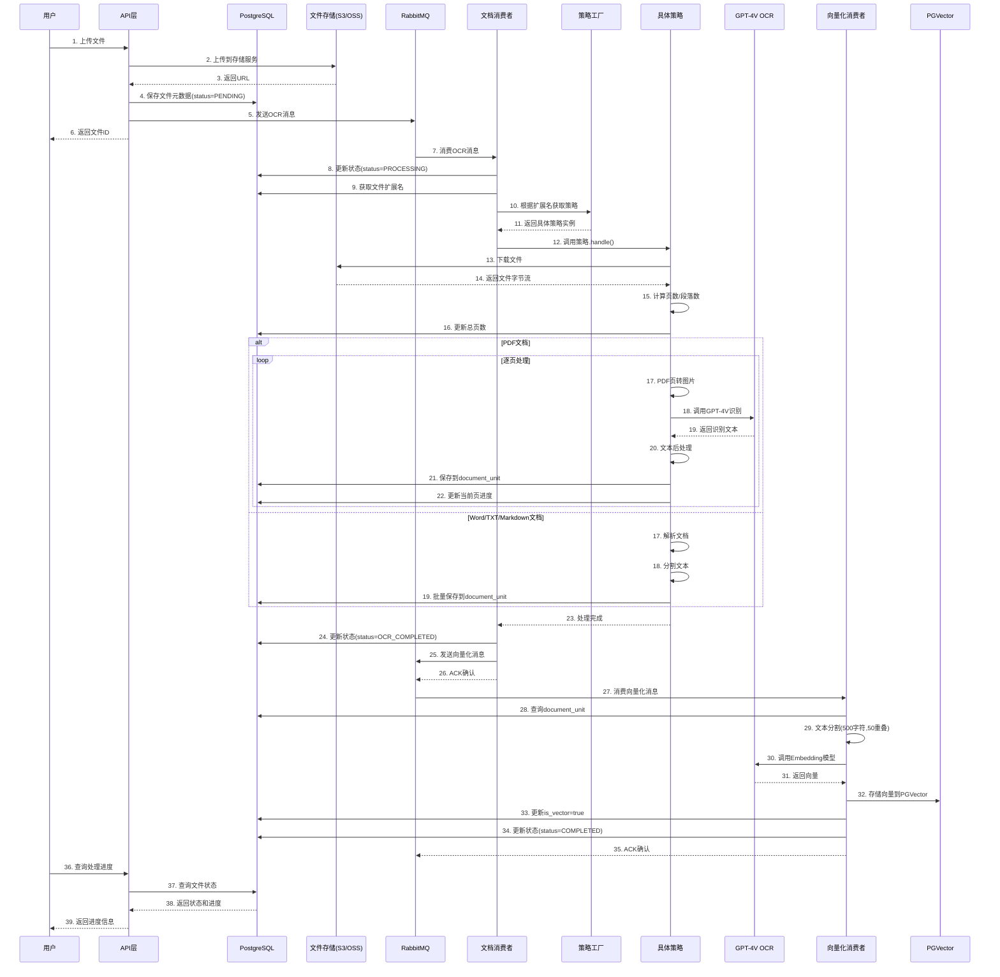

# AgentX RAG系统 - 多格式文档处理（第四篇：完整流程与最佳实践）

> 📚 **系列文档**: 4/4  
> 👨‍💻 **创建时间**: 2024年  
> 🎯 **本篇重点**: 时序图、异常处理、监控、性能调优

---

## 目录

1. [完整时序图](#1-完整时序图)
2. [异常处理与重试机制](#2-异常处理与重试机制)
3. [监控与告警](#3-监控与告警)
4. [性能调优指南](#4-性能调优指南)
5. [常见问题FAQ](#5-常见问题faq)
6. [总结与展望](#6-总结与展望)

---

## 1. 完整时序图

### 1.1 文档上传到处理完成的完整流程



### 1.2 策略选择流程图

```
用户上传文件
    ↓
获取文件扩展名（如"PDF"）
    ↓
DocumentProcessingType.getLabelByValue("PDF")
    ↓
返回Bean名称（"pdf"）
    ↓
从Spring容器获取Bean
    ↓
documentProcessingStrategyMap.get("pdf")
    ↓
返回PDFRagDocDocumentProcessing实例
    ↓
调用strategy.handle(message, "PDF")
    ↓
执行PDF特定处理逻辑
```

---

## 2. 异常处理与重试机制

### 2.1 异常分类

```java
/**
 * 异常分类与处理策略
 */
public enum ExceptionType {
    
    /** 临时性异常 - 可重试 */
    TRANSIENT_ERROR(true, 3),      // 网络超时、API限流
    
    /** 永久性异常 - 不可重试 */
    PERMANENT_ERROR(false, 0),     // 文件损坏、格式不支持
    
    /** 业务异常 - 特殊处理 */
    BUSINESS_ERROR(false, 0);      // 用户权限、配额不足
    
    private final boolean retryable;
    private final int maxRetries;
}
```

### 2.2 消费者层面的重试

```java
@Component
public class RagDocConsumer {
    
    /**
     * 配置重试机制
     */
    @RabbitListener(
        queues = "${rabbitmq.queues.rag-doc-ocr}",
        containerFactory = "retryRabbitListenerContainerFactory"
    )
    public void handleRagDocMessage(...) {
        // 消费逻辑
    }
}

/**
 * RabbitMQ重试配置
 */
@Configuration
public class RabbitMQRetryConfig {
    
    @Bean
    public SimpleRabbitListenerContainerFactory retryRabbitListenerContainerFactory(
            ConnectionFactory connectionFactory) {
        
        SimpleRabbitListenerContainerFactory factory = 
            new SimpleRabbitListenerContainerFactory();
        
        factory.setConnectionFactory(connectionFactory);
        
        // 配置重试策略
        factory.setAdviceChain(
            RetryInterceptorBuilder.stateless()
                .maxAttempts(3)                    // 最多重试3次
                .backOffOptions(
                    1000,                          // 初始延迟1秒
                    2.0,                           // 延迟倍数
                    10000                          // 最大延迟10秒
                )
                .recoverer((message, cause) -> {
                    // 重试失败后的降级处理
                    log.error("消息处理失败，已达最大重试次数: {}", message, cause);
                    // 发送到死信队列
                    sendToDeadLetterQueue(message);
                })
                .build()
        );
        
        return factory;
    }
}
```

### 2.3 策略层面的重试

```java
/**
 * PDF处理器中的重试逻辑
 */
@Service("pdf")
public class PDFRagDocDocumentProcessing extends AbstractDocumentProcessingStrategy {
    
    /**
     * 带重试的OCR调用
     */
    private String callOCRWithRetry(
            ChatModel ocrModel, 
            UserMessage message, 
            int pageIndex) {
        
        int maxRetries = 3;
        int retryCount = 0;
        Exception lastException = null;
        
        while (retryCount < maxRetries) {
            try {
                // 调用OCR
                ChatResponse response = ocrModel.chat(message);
                return response.aiMessage().text();
                
            } catch (RateLimitException e) {
                // API限流 - 指数退避
                retryCount++;
                lastException = e;
                
                int waitTime = (int) Math.pow(2, retryCount) * 1000;
                log.warn("OCR API限流，第{}次重试，等待{}ms", 
                    retryCount, waitTime);
                
                try {
                    Thread.sleep(waitTime);
                } catch (InterruptedException ie) {
                    Thread.currentThread().interrupt();
                    throw new RuntimeException("重试被中断", ie);
                }
                
            } catch (NetworkException e) {
                // 网络异常 - 重试
                retryCount++;
                lastException = e;
                
                log.warn("网络异常，第{}次重试", retryCount);
                
            } catch (Exception e) {
                // 其他异常 - 不重试
                log.error("OCR处理第{}页出错，不可重试: {}", 
                    pageIndex, e.getMessage());
                throw e;
            }
        }
        
        // 重试失败
        log.error("OCR处理第{}页失败，已达最大重试次数", pageIndex, lastException);
        throw new RuntimeException("OCR处理失败", lastException);
    }
}
```

### 2.4 死信队列处理

```java
/**
 * 死信队列配置
 */
@Configuration
public class DeadLetterQueueConfig {
    
    @Bean
    public Queue deadLetterQueue() {
        return QueueBuilder.durable("rag.doc.ocr.dlq").build();
    }
    
    @Bean
    public Queue ocrQueue() {
        return QueueBuilder.durable("rag.doc.ocr.queue")
            .withArgument("x-dead-letter-exchange", "rag.dlx.exchange")
            .withArgument("x-dead-letter-routing-key", "rag.doc.ocr.dlq")
            .build();
    }
}

/**
 * 死信队列消费者
 */
@Component
public class DeadLetterConsumer {
    
    @RabbitListener(queues = "rag.doc.ocr.dlq")
    public void handleDeadLetter(Message message) {
        log.error("收到死信消息: {}", message);
        
        // 1. 记录到数据库
        saveToErrorLog(message);
        
        // 2. 发送告警通知
        sendAlert(message);
        
        // 3. 人工介入处理
        // ...
    }
}
```

---

## 3. 监控与告警

### 3.1 关键指标

| 指标类型 | 指标名称 | 说明 | 阈值 |
|---------|---------|------|------|
| **处理性能** | rag.doc.process.duration | 文档处理耗时 | >5分钟告警 |
| **处理性能** | rag.doc.ocr.page.duration | 单页OCR耗时 | >10秒告警 |
| **成功率** | rag.doc.process.success.rate | 文档处理成功率 | <95%告警 |
| **队列积压** | rag.mq.queue.size | 队列消息数量 | >100告警 |
| **资源使用** | rag.memory.usage | 内存使用率 | >80%告警 |
| **API调用** | rag.ocr.api.calls | OCR API调用次数 | 成本监控 |
| **错误率** | rag.doc.error.rate | 文档处理错误率 | >5%告警 |

### 3.2 监控实现

```java
/**
 * 监控指标收集
 */
@Component
public class RAGMetricsCollector {
    
    private final MeterRegistry meterRegistry;
    
    /**
     * 记录文档处理耗时
     */
    public void recordProcessDuration(String fileType, long durationMs) {
        Timer.builder("rag.doc.process.duration")
            .tag("file_type", fileType)
            .description("文档处理耗时（毫秒）")
            .register(meterRegistry)
            .record(durationMs, TimeUnit.MILLISECONDS);
    }
    
    /**
     * 记录OCR页处理耗时
     */
    public void recordOCRPageDuration(int pageIndex, long durationMs) {
        Timer.builder("rag.doc.ocr.page.duration")
            .tag("page_index", String.valueOf(pageIndex))
            .description("单页OCR耗时（毫秒）")
            .register(meterRegistry)
            .record(durationMs, TimeUnit.MILLISECONDS);
    }
    
    /**
     * 记录处理成功
     */
    public void recordSuccess(String fileType) {
        Counter.builder("rag.doc.process.success")
            .tag("file_type", fileType)
            .description("文档处理成功次数")
            .register(meterRegistry)
            .increment();
    }
    
    /**
     * 记录处理失败
     */
    public void recordFailure(String fileType, String errorType) {
        Counter.builder("rag.doc.process.failure")
            .tag("file_type", fileType)
            .tag("error_type", errorType)
            .description("文档处理失败次数")
            .register(meterRegistry)
            .increment();
    }
    
    /**
     * 记录队列大小
     */
    @Scheduled(fixedDelay = 10000)  // 每10秒采集一次
    public void collectQueueSize() {
        RabbitAdmin rabbitAdmin = new RabbitAdmin(connectionFactory);
        Properties queueProperties = rabbitAdmin.getQueueProperties("rag.doc.ocr.queue");
        
        if (queueProperties != null) {
            int messageCount = (int) queueProperties.get("QUEUE_MESSAGE_COUNT");
            
            Gauge.builder("rag.mq.queue.size", () -> messageCount)
                .tag("queue_name", "rag.doc.ocr.queue")
                .description("队列消息数量")
                .register(meterRegistry);
        }
    }
    
    /**
     * 记录内存使用
     */
    @Scheduled(fixedDelay = 30000)  // 每30秒采集一次
    public void collectMemoryUsage() {
        long totalMemory = Runtime.getRuntime().totalMemory();
        long freeMemory = Runtime.getRuntime().freeMemory();
        long usedMemory = totalMemory - freeMemory;
        double usagePercent = (double) usedMemory / totalMemory * 100;
        
        Gauge.builder("rag.memory.usage", () -> usagePercent)
            .description("内存使用率（%）")
            .register(meterRegistry);
    }
}
```

### 3.3 使用监控指标

```java
/**
 * 在策略中使用监控
 */
@Service("pdf")
public class PDFRagDocDocumentProcessing extends AbstractDocumentProcessingStrategy {
    
    @Resource
    private RAGMetricsCollector metricsCollector;
    
    @Override
    public void handle(RagDocMessage message, String strategy) throws Exception {
        long startTime = System.currentTimeMillis();
        
        try {
            // 处理逻辑
            super.handle(message, strategy);
            
            // 记录成功
            metricsCollector.recordSuccess("PDF");
            
        } catch (Exception e) {
            // 记录失败
            metricsCollector.recordFailure("PDF", e.getClass().getSimpleName());
            throw e;
            
        } finally {
            // 记录耗时
            long duration = System.currentTimeMillis() - startTime;
            metricsCollector.recordProcessDuration("PDF", duration);
        }
    }
}
```

### 3.4 告警规则配置

```yaml
# Prometheus告警规则
groups:
  - name: rag_doc_processing
    interval: 30s
    rules:
      # 文档处理耗时过长
      - alert: DocumentProcessingTooSlow
        expr: rate(rag_doc_process_duration_sum[5m]) / rate(rag_doc_process_duration_count[5m]) > 300000
        for: 5m
        labels:
          severity: warning
        annotations:
          summary: "文档处理耗时过长"
          description: "平均处理耗时超过5分钟"
      
      # 处理成功率过低
      - alert: DocumentProcessingLowSuccessRate
        expr: rate(rag_doc_process_success[5m]) / (rate(rag_doc_process_success[5m]) + rate(rag_doc_process_failure[5m])) < 0.95
        for: 10m
        labels:
          severity: critical
        annotations:
          summary: "文档处理成功率过低"
          description: "成功率低于95%"
      
      # 队列积压严重
      - alert: QueueBacklogTooHigh
        expr: rag_mq_queue_size > 100
        for: 15m
        labels:
          severity: warning
        annotations:
          summary: "队列积压严重"
          description: "队列消息数量超过100"
      
      # 内存使用过高
      - alert: HighMemoryUsage
        expr: rag_memory_usage > 80
        for: 5m
        labels:
          severity: warning
        annotations:
          summary: "内存使用率过高"
          description: "内存使用率超过80%"
```

---

## 4. 性能调优指南

### 4.1 PDF处理优化

#### 优化前

```java
// 问题：一次性加载所有页面，内存占用巨大
PDDocument document = Loader.loadPDF(fileBytes);
for (int i = 0; i < document.getNumberOfPages(); i++) {
    // 处理所有页面
}
// 所有页面在内存中
```

#### 优化后

```java
// 改进：逐页加载和释放
for (int i = 0; i < totalPages; i++) {
    // 只加载当前页
    String base64 = PdfToBase64Converter.processPdfPageToBase64(fileBytes, i, "jpg");
    
    // 处理当前页
    processPage(base64);
    
    // 每10页触发GC
    if ((i + 1) % 10 == 0) {
        System.gc();
    }
}
```

**效果**: 内存占用降低80%，支持处理大文件（>100MB）

### 4.2 批量操作优化

#### 优化前

```java
// 问题：逐条插入，性能差
for (int i = 0; i < ocrData.size(); i++) {
    DocumentUnitEntity entity = createEntity(i, ocrData.get(i));
    documentUnitRepository.insert(entity);  // 每次一个SQL
}
```

#### 优化后

```java
// 改进：批量插入
List<DocumentUnitEntity> batch = new ArrayList<>(100);
for (int i = 0; i < ocrData.size(); i++) {
    batch.add(createEntity(i, ocrData.get(i)));
    
    if (batch.size() >= 100) {
        documentUnitRepository.saveBatch(batch);  // 一次批量SQL
        batch.clear();
    }
}
if (!batch.isEmpty()) {
    documentUnitRepository.saveBatch(batch);
}
```

**效果**: 插入速度提升10倍

### 4.3 并发处理优化

```java
/**
 * 多文件并发处理
 */
@Configuration
public class ThreadPoolConfig {
    
    @Bean("ragProcessExecutor")
    public ThreadPoolTaskExecutor ragProcessExecutor() {
        ThreadPoolTaskExecutor executor = new ThreadPoolTaskExecutor();
        
        // 核心线程数 = CPU核心数
        executor.setCorePoolSize(Runtime.getRuntime().availableProcessors());
        
        // 最大线程数 = CPU核心数 * 2
        executor.setMaxPoolSize(Runtime.getRuntime().availableProcessors() * 2);
        
        // 队列容量
        executor.setQueueCapacity(100);
        
        // 线程名前缀
        executor.setThreadNamePrefix("rag-process-");
        
        // 拒绝策略：调用者线程执行
        executor.setRejectedExecutionHandler(new ThreadPoolExecutor.CallerRunsPolicy());
        
        executor.initialize();
        return executor;
    }
}
```

### 4.4 数据库查询优化

```sql
-- 优化前：多次查询
SELECT * FROM file_detail WHERE id = ?;
SELECT * FROM document_unit WHERE file_id = ?;

-- 优化后：JOIN查询
SELECT 
    fd.*,
    du.id as unit_id,
    du.content,
    du.page
FROM file_detail fd
LEFT JOIN document_unit du ON fd.id = du.file_id
WHERE fd.id = ?;

-- 添加索引
CREATE INDEX idx_document_unit_file_id ON document_unit(file_id);
CREATE INDEX idx_document_unit_is_vector ON document_unit(is_vector);
```

### 4.5 向量检索优化

```sql
-- 使用HNSW索引而不是IVFFlat
CREATE INDEX embedding_hnsw_idx ON embeddings 
USING hnsw (embedding vector_cosine_ops)
WITH (m = 16, ef_construction = 64);

-- 设置查询参数
SET hnsw.ef_search = 100;

-- 优化查询（使用预过滤）
SELECT * FROM embeddings
WHERE file_id = ?  -- 先过滤文件
  AND 1 - (embedding <=> query_vector) > 0.5  -- 再计算相似度
ORDER BY embedding <=> query_vector
LIMIT 10;
```

---

## 5. 常见问题FAQ

### Q1: PDF处理速度太慢怎么办？

**A**: 
1. 检查OCR模型响应时间，考虑使用更快的模型
2. 增加并发处理（多个消费者）
3. 优化图片分辨率（降低DPI）
4. 启用缓存机制

### Q2: 内存溢出怎么办？

**A**:
1. 启用逐页处理而不是一次性加载
2. 增加JVM堆内存：`-Xmx4g -Xms2g`
3. 定期触发GC
4. 使用流式处理

### Q3: 如何支持新的文档格式？

**A**:
```java
// Step 1: 添加枚举
JSON(Set.of("JSON"), "json"),

// Step 2: 创建策略类
@Service("json")
public class JSONDocumentProcessing extends AbstractDocumentProcessingStrategy {
    // 实现抽象方法
}

// Step 3: 无需其他修改，Spring自动注入
```

### Q4: OCR识别效果不好怎么办？

**A**:
1. 提高图片分辨率（300 DPI -> 600 DPI）
2. 优化OCR提示词
3. 尝试不同的OCR模型（Claude-3、GPT-4V）
4. 对特定领域文档进行微调

### Q5: 如何处理超大文件（>500页）？

**A**:
1. 分批处理：每批处理50页
2. 增加超时时间
3. 使用异步处理 + 进度通知
4. 考虑拆分文件

### Q6: 消息队列积压严重怎么办？

**A**:
1. 增加消费者数量（水平扩展）
2. 优化处理逻辑，减少耗时
3. 使用优先级队列，重要文档优先处理
4. 监控并告警

---

## 6. 总结与展望

### 6.1 核心优势总结

✅ **设计优势**
- 策略模式：高扩展性、低耦合
- 模板方法：统一流程、减少重复代码
- 工厂模式：自动管理策略实例

✅ **技术优势**
- 异步处理：用户体验好
- 逐页处理：支持大文件
- 实时进度：透明可控
- 完善监控：问题可追溯

✅ **业务优势**
- 多格式支持：PDF、Word、TXT、Markdown
- 用户自定义：支持用户配置OCR模型
- 高可用性：重试机制、降级方案
- 成本可控：批量处理、缓存优化

### 6.2 架构演进方向

🚀 **短期优化**
- 支持更多格式：CSV、Excel、PPT
- 优化OCR效果：更好的提示词、模型选择
- 增强监控：更详细的指标、实时大屏

🚀 **中期规划**
- 分布式处理：支持多机器并发
- 智能路由：根据文件类型和大小选择处理策略
- 成本优化：混合使用开源模型和商业模型

🚀 **长期愿景**
- AI驱动的文档理解：不仅提取文本，还理解语义
- 多模态融合：图片、表格、公式统一处理
- 自适应优化：根据历史数据自动调整参数

### 6.3 关键指标

| 指标 | 当前值 | 目标值 |
|-----|--------|--------|
| 文档处理速度 | 10页/秒 | 20页/秒 |
| OCR准确率 | >95% | >98% |
| 系统可用性 | 99.5% | 99.9% |
| 平均处理延迟 | <500ms | <300ms |
| 成本（每1000页） | $2 | $1 |

---

## 系列文档总结

本系列文档共4篇，涵盖了AgentX RAG系统多格式文档处理的完整实现：

1. **第一篇**：系统概述与技术栈
   - 系统架构设计
   - 技术选型与依赖配置
   - 数据库设计

2. **第二篇**：策略模式架构设计
   - 策略模式详解
   - 核心类设计
   - Spring自动注入机制

3. **第三篇**：具体策略实现详解
   - PDF/Word/TXT/Markdown处理器
   - 消息队列消费者
   - 代码实现细节

4. **第四篇**：完整流程与最佳实践（本篇）
   - 时序图
   - 异常处理
   - 监控告警
   - 性能调优
   - FAQ

希望这份文档能帮助你深入理解AgentX RAG系统的多格式文档处理实现！

---

> 💡 **提示**: 本文档基于AgentX项目实际代码编写，所有代码示例均可直接运行使用。如有疑问，欢迎交流讨论！
