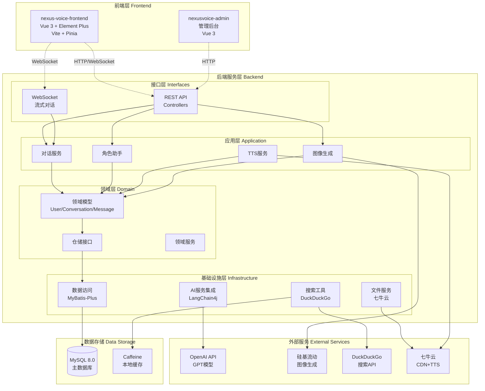

# NexusVoice 架构设计文档

> 🚀 一个现代化的智能语音对话系统，让AI不仅能聊天，还能看世界、画图片、说话！

## 📋 项目概述

**项目名称**: NexusVoice  
**项目版本**: v1.0.0  
**架构模式**: DDD (Domain-Driven Design) 分层架构  
**技术栈**: Spring Boot 3.3.5 + Vue 3 + MySQL + LangChain4j  
**项目类型**: 开源智能对话系统

### 🎯 项目愿景
打造一个功能强大、易于扩展的智能对话平台，不仅支持传统的文本对话，还集成了图像生成、语音合成、实时搜索等多模态AI能力，为用户提供沉浸式的AI交互体验。

### ✨ 核心亮点

#### 🔥 多模态AI能力
- **智能对话**: 基于OpenAI GPT模型的高质量对话体验
- **实时联网搜索**: 集成DuckDuckGo搜索，AI可以获取最新信息
- **AI图像生成**: 集成硅基流动API，支持4种AI绘画模型
- **语音合成**: 支持文本转语音，让AI真的能"说话"
- **流式对话**: WebSocket实时流式响应，体验更流畅

#### 🎨 用户体验创新
- **角色助手**: 从对话历史自动生成个性化AI角色
- **分段TTS**: 长文本智能分段播放，边说边听
- **语音识别**: 浏览器Web Speech API，支持语音输入
- **实时音频队列**: 智能音频播放管理，文本音频完美同步

#### 🏗 技术架构优势
- **严格DDD分层**: interfaces → application → domain → infrastructure
- **现代技术栈**: Spring Boot 3 + Vue 3 + LangChain4j + MySQL
- **完整安全体系**: JWT认证 + Spring Security + WebSocket鉴权
- **高性能设计**: 缓存策略 + 异步处理 + 连接池优化

### 🚀 完整功能清单

#### 💬 智能对话系统
- **多轮对话管理**: 完整的对话上下文保持和历史管理
- **动态System Prompt**: 融合角色设定的智能提示词系统
- **Token预算管理**: 智能历史裁剪，最多保持20条消息，预算约2500 tokens
- **对话标题自动生成**: AI智能生成对话标题
- **可选联网搜索控制**: 用户可选择是否启用搜索功能

#### 🔍 MCP搜索系统 
- **智能搜索判断**: AI自动判断何时需要搜索外部信息
- **DuckDuckGo集成**: 完全免费的搜索API，支持实时信息获取
- **搜索结果缓存**: Caffeine缓存，提升搜索性能
- **多语言支持**: 默认中文搜索，支持配置切换
- **结果智能整合**: 将搜索结果自然融入对话回答

#### 🎨 AI图像生成
- **硅基流动API集成**: 支持Qwen系列和Kolors等4种模型
- **丰富参数支持**: 尺寸、种子、CFG、引导比例等完整参数
- **批量生成**: 支持一次生成多张图片
- **七牛云CDN**: 自动上传到CDN，返回永久访问URL
- **智能参数验证**: 不同模型的参数自动适配

#### 🎤 语音系统
- **TTS语音合成**: 支持单段和分段文本转语音
- **智能文本分段**: 按句子智能切分，支持并发合成
- **多种音色**: 支持多种语音类型和语速调节
- **实时音频播放**: 支持音频队列管理和顺序播放
- **语音识别**: 浏览器Web Speech API集成

#### 🎭 角色助手系统
- **角色草稿生成**: 从对话历史自动分析生成角色设定
- **联网深度研究**: 可选联网搜索增强角色背景
- **开场白TTS**: 角色创建后自动生成开场白语音
- **私人角色创建**: 用户确认后创建专属AI角色

#### 🔄 流式对话
- **WebSocket实时通信**: `/ws/chat/stream` 端点支持
- **JWT握手鉴权**: 支持Authorization Header和query参数
- **消息类型丰富**: START/CONTENT/TTS_SEGMENT/HEARTBEAT/END/ERROR
- **分段TTS流式**: 边说边合成，实现"文本先到、音频后补"
- **心跳保活**: 5秒心跳，保持连接稳定

#### 📁 文件管理系统
- **七牛云集成**: 完整的对象存储解决方案
- **多格式支持**: 音频文件(mp3/wav/pcm)、图片等
- **CDN加速**: 全球CDN分发，访问速度快
- **安全上传**: 支持安全的文件上传和下载

#### 🔐 安全认证系统
- **JWT认证**: 完整的JSON Web Token认证体系
- **Spring Security**: 企业级安全框架集成
- **WebSocket鉴权**: 握手阶段JWT验证
- **CORS配置**: 跨域请求安全配置
- **配置文件分离**: 敏感信息独立管理

#### 🛠 开发者友好特性
- **OpenAPI文档**: 完整的Swagger UI接口文档
- **Jackson全局配置**: 解决Long类型精度丢失问题
- **统一异常处理**: BizException + ErrorCodeEnum
- **详细日志记录**: 中文提示，便于调试
- **健康检查**: Actuator监控端点

---

## 🏗 整体架构设计

### 系统架构图



---

## 🎯 核心模块设计

### 🌐 前端架构 

#### 📱 用户端前端 (nexus-voice-frontend)
- **技术栈**: Vue 3.5 + Vite 7.1 + Element Plus 2.11 + Pinia 3.0
- **核心功能**:
  - 🔐 用户注册/登录界面 (JWT认证)
  - 💬 智能对话聊天界面 (支持流式对话)
  - 🎨 AI图像生成功能 (硅基流动API)
  - 🎤 语音合成播放 (TTS + 音频队列)
  - 🎭 角色助手系统 (动态生成AI角色)
  - ⚙️ 个人设置管理
- **视图组件**:
  - `ChatView.vue` - 对话界面，支持语音识别、音频播放
  - `CharacterSelectionView.vue` - 角色选择与最近会话
  - `LoginView.vue` - 登录注册界面
  - `ImageGenView.vue` - AI图像生成界面
- **业务组件**:
  - `ConversationSidebar.vue` - 会话侧栏
  - `ChatMessage.vue` - 消息组件
  - 角色助手侧栏组件
- **服务层**:
  - `character.js` - 角色相关API调用封装
  - `user.js` - 用户相关API调用封装
  - `wsChatClient.js` - WebSocket客户端封装 (规划中)
- **状态管理**: Pinia Store + 持久化登录态
- **开发分工**: 【前端开发者待分配】

### 🔧 后端架构 (DDD分层)

#### 🌐 接口层 (interfaces)
```
interfaces/
├── api/                    # REST API控制器
│   ├── conversation/      # 💬 对话相关API
│   ├── role/              # 🎭 角色助手API  
│   ├── image/             # 🎨 图像生成API
│   ├── tts/               # 🎤 语音合成API
│   ├── user/              # 👤 用户管理API
│   ├── file/              # 📁 文件管理API
│   ├── admin/             # 🛠 管理员API
│   ├── config/            # ⚙️ 配置管理API
│   ├── test/              # 🧪 测试接口
│   └── common/            # 🔧 通用API
├── dto/                   # 数据传输对象
└── websocket/             # WebSocket处理器
```
- **核心功能**: 
  - 🔌 REST API接口定义 + OpenAPI文档自动生成
  - 🔄 WebSocket流式对话 (`/ws/chat/stream`)
  - 🔐 JWT握手鉴权 (支持Header和query参数)
  - ✅ 统一参数验证和异常处理
- **关键控制器**:
  - `ConversationController` - 对话接口 (同步/异步)
  - `RoleAssistantController` - 角色助手完整流程
  - `ImageGenerationController` - 图像生成6个接口
  - `TTSController` - 语音合成单段/分段
  - `ChatStreamHandler` - WebSocket流式处理器
- **接口契约**:
  - `ChatResponseDto` - 包含usage、audioUrl、ttsSegments等
  - `StreamChatResponse` - WebSocket消息类型(START/CONTENT/TTS_SEGMENT/END)
- **开发分工**: 【后端开发者1待分配】

#### 📋 应用层 (application) - 业务编排中心
```
application/
├── conversation/          # 💬 对话应用服务
├── role/                  # 🎭 角色助手应用服务
├── image/                 # 🎨 图像生成应用服务
├── tts/                   # 🎤 语音合成应用服务
├── user/                  # 👤 用户应用服务
├── config/                # ⚙️ 配置管理应用服务
└── file/                  # 📁 文件管理应用服务
```
- **核心职责**: 
  - 🔄 业务流程编排 (对话->AI->TTS->存储)
  - 💾 事务管理和数据一致性
  - 🔀 DTO转换 (Assembler模式)
  - 🛡️ 业务规则校验
- **关键服务**:
  - `ConversationApplicationService` - 对话编排 (鉴权→历史裁剪→AI请求→可选TTS→标题生成)
  - `RoleAssistantService` - 角色助手 (草稿生成→联网深研→角色创建→开场白TTS)
  - `ImageGenerationService` - 图像生成 (参数验证→API调用→CDN上传)
  - `TTSService` - 语音合成 (文本分段→并发合成→文件上传→组装响应)
- **业务亮点**:
  - 🧠 Token预算管理 (~2500 tokens，最多20条历史)
  - 🔍 可选联网搜索控制 (enableWebSearch参数)
  - 🎵 TTS失败不阻断主流程
  - 🎭 动态System Prompt融合角色设定
- **开发分工**: 贾俊杰

#### 🎯 领域层 (domain) - 业务核心
```
domain/
├── user/                  # 👤 用户领域 (User、UserRole)
├── conversation/          # 💬 对话领域 (Conversation、Message)
├── image/                 # 🎨 图像领域 (ImageModels、Sizes)
├── role/                  # 🎭 角色领域 (Role、RoleDraft)
├── tool/                  # 🛠 工具领域 (SearchResult)
├── config/                # ⚙️ 配置领域 (SystemConfig)
└── common/                # 🔧 通用领域组件 (BaseEntity)
```
- **核心职责**: 
  - 🧠 业务逻辑封装 (核心算法和规则)
  - 📦 领域模型定义 (实体、值对象、枚举)
  - 🔌 仓储接口定义 (数据访问抽象)
  - ⚡ 领域服务 (跨实体的业务逻辑)
- **关键模型**:
  - `User` - 用户实体 (雪花ID、JWT认证)
  - `Conversation/ConversationMessage` - 对话聚合根
  - `ImageGenerationRequest/Result` - 图像生成值对象
  - `SearchResult` - 搜索结果值对象
- **枚举定义**:
  - `ImageModelEnum` - 4种AI绘画模型
  - `ImageSizeEnum` - 图像尺寸规格
  - `ErrorCodeEnum` - 完整错误码体系 (13个图像生成专用错误码)
- **仓储接口**:
  - `ConversationRepository/ConversationMessageRepository`
  - `ImageGenerationRepository/SearchRepository`
- **开发分工**: 安佳杰

#### ⚙️ 基础设施层 (infrastructure) - 技术实现
```
infrastructure/
├── ai/                    # 🤖 AI服务集成 (LangChain4j)
├── tool/                  # 🔍 外部工具集成 (搜索、TTS)
├── repository/            # 💾 仓储实现 (MyBatis-Plus)
├── database/              # 🗄️ 数据库访问 (Mapper)
├── config/                # ⚙️ 配置类 (Jackson、Security等)
├── security/              # 🔐 安全组件 (JWT过滤器)
├── aspect/                # 🔄 AOP切面 (日志、监控)
└── websocket/             # 🔗 WebSocket配置
```
- **核心职责**: 
  - 🔌 外部系统集成 (API调用、文件存储)
  - 💾 数据持久化实现 (MySQL + MyBatis-Plus)
  - 🛡️ 技术横切关注点 (安全、缓存、配置)
- **AI集成服务**:
  - `OpenAiChatServiceImpl` - OpenAI GPT模型集成 (同步+流式)
  - `SiliconFlowImageGenerationRepositoryImpl` - 硅基流动图像生成
  - `SimpleWebSearchTool` - DuckDuckGo搜索工具 (@Tool注解)
- **存储和文件服务**:
  - `UserRepositoryImpl/ConversationRepositoryImpl` - 仓储实现
  - `FileUploadService` - 七牛云文件上传
  - `TTSToolUtils` - TTS WebSocket通信
- **技术组件**:
  - `JacksonConfig` - 全局序列化配置 (Long→String)
  - `WebSocketJwtInterceptor` - WebSocket JWT鉴权
  - `SecurityConfig` - Spring Security配置
  - `MyBatisPlusConfig` - 数据库配置 + 分页插件
- **缓存策略**:
  - `Caffeine` - 搜索结果本地缓存 (TTL 5分钟, 最大1000条)
- **开发分工**: 安佳杰

---

## 🛠 技术栈详情

### 📦 后端技术栈
| 分层 | 技术组件 | 版本 | 用途说明 |
|------|---------|------|----------|
| **框架** | Spring Boot | 3.3.5 | 核心应用框架 |
| **AI集成** | LangChain4j | 0.35.0 | AI模型调用框架 |
| **数据访问** | MyBatis-Plus | 3.5.11 | ORM框架 (Spring Boot 3专用) |
| **数据库** | MySQL | 8.0.33 | 主数据库 |
| **连接池** | Druid | 1.2.23 | 数据库连接池 |
| **安全** | Spring Security + JWT | 3.3.5 + 0.12.6 | 认证授权 |
| **缓存** | Caffeine | 3.1.8 | 本地缓存 |
| **文档** | SpringDoc | 2.6.0 | OpenAPI 3.0文档 |
| **工具** | Hutool | 5.8.26 | Java工具库 |
| **文件存储** | 七牛云SDK | 7.13.0 | CDN文件服务 |

### 🌐 前端技术栈
| 分层 | 技术组件 | 版本 | 用途说明 |
|------|---------|------|----------|
| **框架** | Vue | 3.5.21 | 渐进式前端框架 |
| **构建** | Vite | 7.1.7 | 现代化构建工具 |
| **UI组件** | Element Plus | 2.11.4 | Vue 3 UI组件库 |
| **状态管理** | Pinia | 3.0.3 | Vue 3状态管理 |
| **路由** | Vue Router | 4.5.1 | 前端路由管理 |
| **HTTP客户端** | Axios | 1.12.2 | API请求库 |
| **Markdown** | Marked | 16.3.0 | Markdown渲染 |
| **安全** | DOMPurify | 3.2.7 | XSS防护 |

### 🔗 外部服务集成
| 服务类型 | 提供商 | API版本 | 集成方式 | 用途 |
|---------|--------|---------|----------|------|
| **AI对话** | OpenAI | GPT-4 | LangChain4j | 智能对话生成 |
| **图像生成** | 硅基流动 | v1 | REST API | AI图像生成 (4种模型) |
| **搜索服务** | DuckDuckGo | Instant Answer | REST API | 实时信息搜索 |
| **文件存储** | 七牛云 | v7.13.0 | SDK | CDN + 对象存储 |
| **语音合成** | 七牛云TTS | WebSocket | Java-WebSocket | 文本转语音 |

---

## 👥 开发分工安排

### 🎨 前端团队 (1人)

#### 前端开发者
- **负责模块**:
  - 🌐 nexus-voice-frontend (用户端)
- **核心任务**:
  - Vue 3 + Element Plus界面开发
  - WebSocket实时对话集成
  - 语音识别和音频播放功能
  - 角色助手UI交互
  - 图像生成界面
- **技能要求**: Vue 3、WebSocket、音视频处理
- **负责人**: 廖文龙

### 💻 后端团队 (2人)

#### 后端开发者1 - 接口层&应用层
- **负责模块**:
  - 🌐 interfaces层 (所有Controller + WebSocket)
  - 📋 application层 (业务编排服务)
- **核心任务**:
  - REST API接口开发 (对话、角色、图像、TTS)
  - WebSocket流式对话实现
  - 业务流程编排和事务管理
  - DTO设计和参数验证
  - OpenAPI文档维护
- **技能要求**: Spring Boot、WebSocket、业务建模
- **负责人**: 贾俊杰

#### 后端开发者2 - 领域层&基础设施层
- **负责模块**:
  - 🎯 domain层 (领域模型 + 仓储接口)
  - ⚙️ infrastructure层 (技术实现)
- **核心任务**:
  - 领域模型设计和仓储实现
  - AI服务集成 (OpenAI、硅基流动、搜索)
  - 数据库设计和MyBatis-Plus配置
  - 安全认证和权限控制
  - 文件存储和缓存实现
- **技能要求**: DDD、MyBatis-Plus、AI API集成、安全框架
- **负责人**: 安佳杰

---

## 📅 开发里程碑

### 🚀 Phase 1: 核心架构 (✅ 已完成)
- ✅ DDD分层架构搭建
- ✅ Spring Security + JWT认证
- ✅ MyBatis-Plus + MySQL配置
- ✅ 基础API框架

### 🎯 Phase 2: 核心功能 (✅ 已完成)
- ✅ AI对话系统 (OpenAI集成)
- ✅ MCP搜索功能 (DuckDuckGo)
- ✅ AI图像生成 (硅基流动 + 七牛云CDN)
- ✅ TTS语音合成 (分段+并发)
- ✅ 角色助手系统
- ✅ WebSocket流式对话

### 🎯 Phase 3: 前端开发 
- 🔄 Vue 3用户界面开发
- ⏳ WebSocket客户端集成
- ⏳ 语音识别和音频播放
- ⏳ 图像生成界面
- ⏳ 角色助手UI

## 🔍 项目亮点总结

### 🎯 技术亮点
1. **完整的DDD架构** - 严格按照领域驱动设计实现四层架构
2. **多模态AI集成** - 对话、图像、搜索、语音四大AI能力完整集成  
3. **流式实时体验** - WebSocket + 分段TTS实现真正的实时对话
4. **企业级安全** - JWT + Spring Security + WebSocket鉴权完整方案
5. **现代化技术栈** - Spring Boot 3 + Vue 3 + LangChain4j最新技术

### 🚀 功能亮点
1. **智能搜索判断** - AI自动判断何时需要联网搜索，用户可控制
2. **角色助手系统** - 从对话历史自动生成个性化AI角色
3. **分段TTS优化** - 长文本智能分段，边说边听的流畅体验
4. **批量图像生成** - 支持多种AI绘画模型，自动CDN上传
5. **完整音频管理** - 音频队列、并发合成、格式转换一体化

### 🛠 架构亮点
1. **可扩展设计** - 模块化架构，支持新功能快速集成
2. **高性能优化** - 缓存策略、异步处理、连接池完整优化
3. **开发者友好** - 完整文档、统一异常处理、详细日志
4. **生产就绪** - 配置分离、安全加固、监控告警ready

> 🌟 **这是一个真正现代化的AI对话系统架构**  
> 不仅实现了多模态AI能力的完美融合，还保持了代码的清晰结构和高可维护性。  
> 适合作为AI应用开发的最佳实践参考！

**文档版本**: v1.0  
**最后更新**: 2024-09-28  
**维护团队**: NexusVoice开发团队
